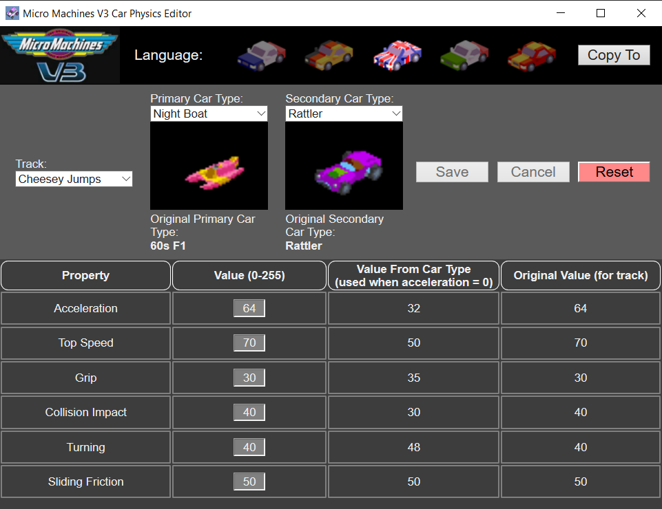

# mmv3-physics-editor

A tool for changing the car types / physics of the playstation game Micro Machines V3 (copyright belongs to Codemasters):

* If you want to change/edit the actual tracks you should checkout the [MMEd](https://github.com/RichardBradley/MMEd) tool

* This gui tool leverages the [webview](https://github.com/zserge/webview) library to build a minimal native GUI
* The basic code structure for the gui follows the [Compactor](https://github.com/Freaky/Compactor) project closely

## Usage
_This tool has only been tested on the European (PAL) version of the game_

When opening the application a file explorer prompt will open. Please select a valid Micro Machines V3 .bin file (not the .cue!)
* Please note that the tool will modify the disk file (so take a backup beforehand!) 

## Build Instructions
To build the app please install rust (via rustup) and run `cargo build --release` from the root directory

**This application will not work in administrator mode due to [this issue](https://github.com/windows-toolkit/Microsoft.Toolkit.Win32/issues/50)**!

## Debugging
There is a VS code config for debugging the rust code (using the MSVC debugger so you may need to install the C++ extension).

For the frontend you can run the [Edge DevTools](https://docs.microsoft.com/en-us/microsoft-edge/devtools-guide).

## Thanks
* Rich Bradley for documenting the MMv3 resources [here](http://www.bradders.org/MMs/php-mms.php)
* Nick Tomlinson for mentioning the cheat engine tool which helped me locate the values in the binary
* [Dege](http://dege.freeweb.hu/) for providing the dgvoodoo2 Direct3D shim & patched MMV3 PC executable (which prompted me to re-investigate the assembly code in the first place)
* Softwire MMs crew for testing the changes